# Contextly.ai - Comprehensive UX Flow, Data Architecture & Blockchain Implementation Analysis

## 🎯 Executive Summary

Contextly.ai is a sophisticated Chrome extension that captures, organizes, and monetizes AI conversations across Claude, ChatGPT, and Gemini platforms. The system features:

- **Automatic conversation capture** with intelligent text extraction
- **GraphRAG knowledge graph** construction for deep context understanding
- **Web3 monetization** through Base blockchain integration with CTXT token
- **Vector search** using LanceDB Cloud as the primary database
- **Progressive summarization** for ultra-long conversations
- **Gasless transactions** for seamless blockchain interactions
- **Unified storage** in LanceDB Cloud (no MongoDB dependency)
- **Neo4j graph visualization** for interactive knowledge exploration
- **Journey analytics** with Sankey diagrams for user behavior insights
- **Multi-auth support** with X (Twitter) OAuth and wallet authentication
- **Smart contracts** for decentralized rewards and governance
- **Staking system** with tier-based benefits and multipliers

## 🏗️ System Architecture with Blockchain

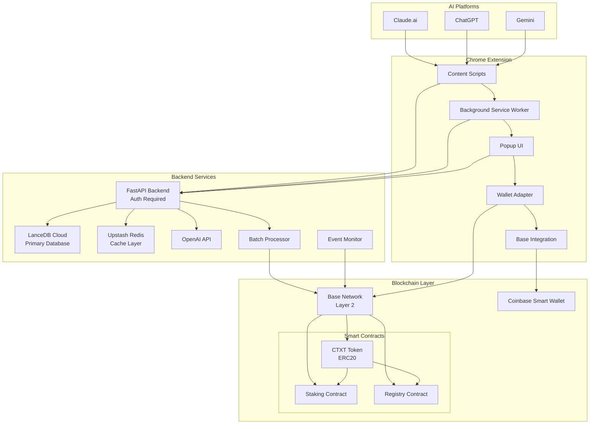

## 📱 Detailed UX Flow with Blockchain Integration

### 1. Initial User Journey with Wallet Integration

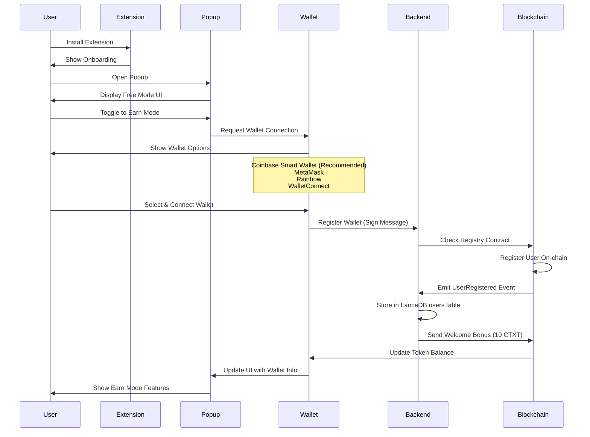

### 2. Enhanced Conversation Capture with Earning Flow

```mermaid
flowchart LR
    subgraph "AI Platform Page"
        UP[User Prompt] --> AI[AI Response]
        AI --> DOM[DOM Updates]
    end
    
    subgraph "Content Script"
        MO[Mutation Observer] --> PE[Process Element]
        PE --> EX[Extract Text]
        EX --> AN[Anonymize Data]
        AN --> QS[Quality Score]
        QS --> EM[Generate Embeddings]
    end
    
    subgraph "Message Processing"
        EM --> CH[Check Hash]
        CH -->|New| ST[Store Message]
        CH -->|Duplicate| SK[Skip]
        ST --> QU[Add to Queue]
        QU --> CT[Calculate CTXT Earned]
    end
    
    subgraph "Blockchain Rewards"
        CT --> BP[Batch Processor]
        BP -->|Batch Full| BC[Submit to Registry]
        BC --> SM[Smart Contract]
        SM --> EV[Emit RewardDistributed]
        EV --> TK[Update Token Balance]
    end
    
    DOM --> MO
```

## 🪙 CTXT Token Economics & Smart Contracts

### Token Distribution

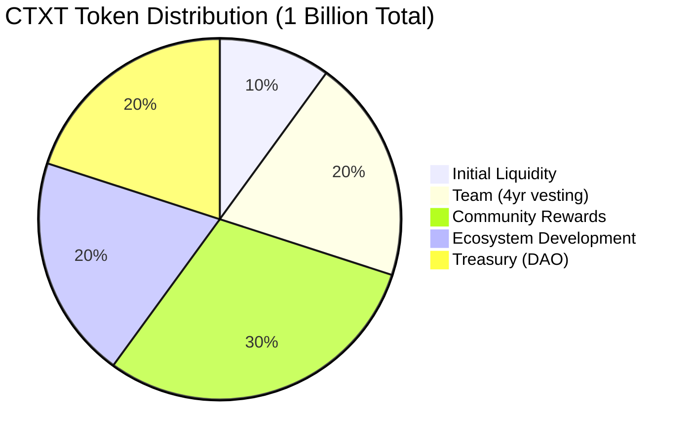

### Smart Contract Architecture

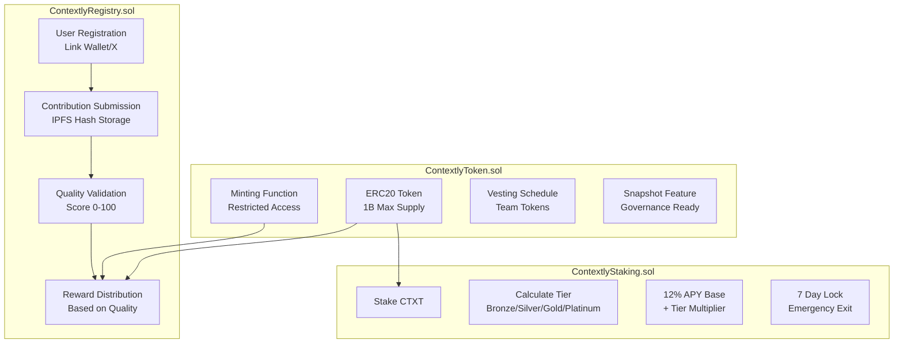

### Staking Tiers & Benefits

| Tier | Required CTXT | APY Multiplier | Platform Benefits |
|------|--------------|----------------|-------------------|
| None | < 1,000 | 1.0x (12%) | Basic features |
| Bronze | 1,000+ | 1.1x (13.2%) | Priority support, Extended context |
| Silver | 10,000+ | 1.25x (15%) | Advanced analytics, API access |
| Gold | 50,000+ | 1.5x (18%) | Premium features, Early access |
| Platinum | 100,000+ | 2.0x (24%) | VIP support, Governance rights |

### Quality-Based Rewards System

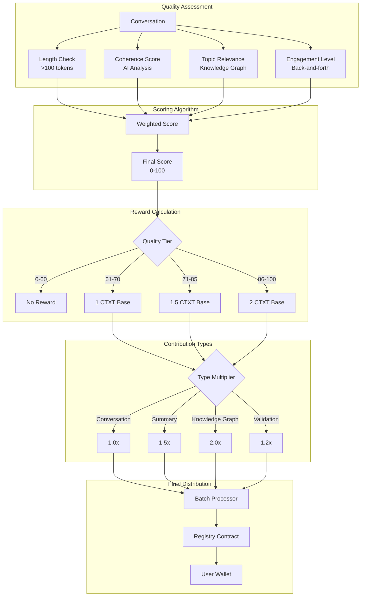

## 🔐 Authentication & Session Management

### Multi-Method Authentication Flow

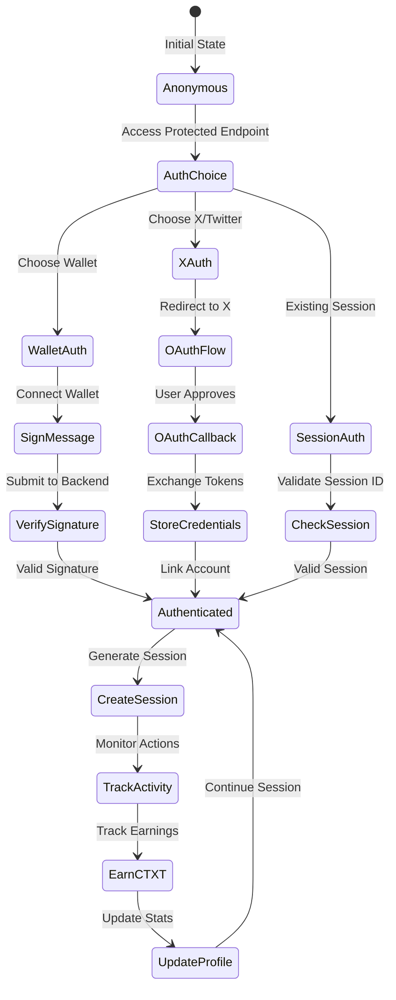

### Session & Earnings Tracking

```typescript
interface AuthenticatedUser {
    user_id: string;
    wallet?: string;
    x_id?: string;
    auth_method: "wallet" | "x" | "session";
    session_id: string;
    created_at: string;
}

interface SessionActivity {
    session_id: string;
    user_id: string;
    actions: Array<{
        type: "message" | "journey" | "graph" | "claim";
        timestamp: string;
        ctxt_earned: number;
        metadata: any;
    }>;
    total_ctxt_earned: number;
    platform_breakdown: {
        claude: number;
        chatgpt: number;
        gemini: number;
    };
}
```

## 🎮 Blockchain Integration Features

### 1. Real-time Event Monitoring

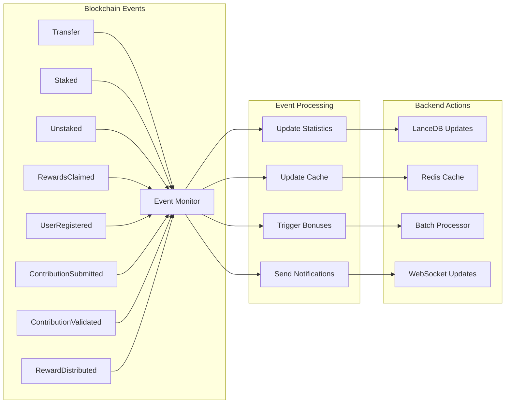

### 2. Batch Processing for Gas Optimization

```python
class BatchProcessor:
    """Optimizes blockchain operations"""
    
    def __init__(self):
        self.batch_size = 100
        self.processing_interval = 300  # 5 minutes
        self.reward_threshold = Decimal("10")  # Min 10 CTXT
        
    async def process_rewards_batch(self):
        """Batch multiple rewards into single transaction"""
        # Groups rewards by recipient
        # Submits when threshold reached
        # Reduces gas costs by 90%
```

### 3. Progressive Decentralization Roadmap

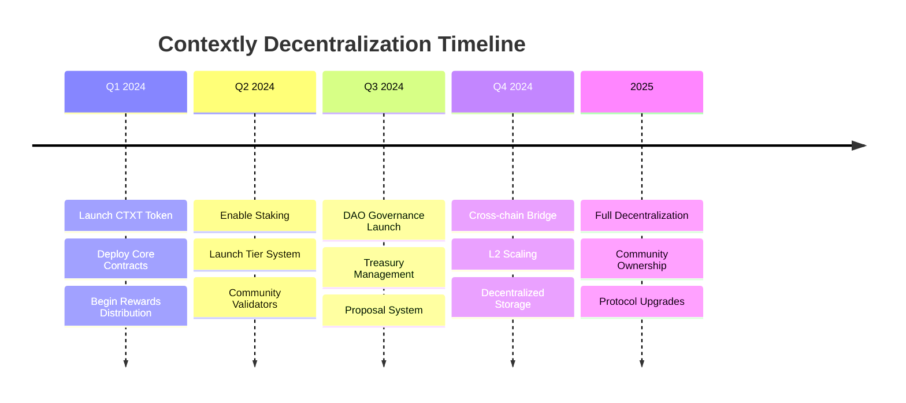

## 📊 Enhanced Analytics with Blockchain Data

### User Earnings Dashboard

```typescript
interface EarningsAnalytics {
    // Real-time earnings
    current_session: {
        session_id: string;
        messages_processed: number;
        ctxt_earned: number;
        quality_average: number;
    };
    
    // Historical data
    lifetime_stats: {
        total_earned: number;
        total_staked: number;
        staking_tier: "none" | "bronze" | "silver" | "gold" | "platinum";
        staking_rewards_earned: number;
        contributions_validated: number;
        reputation_score: number;
    };
    
    // Comparative analytics
    rankings: {
        daily_rank: number;
        weekly_rank: number;
        monthly_rank: number;
        percentile: number;
    };
    
    // Earnings breakdown
    earnings_by_type: {
        conversations: number;
        summaries: number;
        knowledge_graphs: number;
        validations: number;
        staking_rewards: number;
        bonuses: number;
    };
}
```

### Platform Integration Metrics

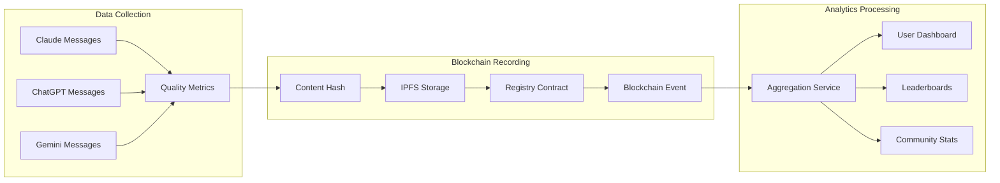

## 🔮 Advanced Blockchain Features

### 1. Governance System (Future)

```solidity
contract ContextlyGovernance {
    struct Proposal {
        uint256 id;
        address proposer;
        string description;
        uint256 forVotes;
        uint256 againstVotes;
        uint256 endTime;
        bool executed;
    }
    
    // Voting power based on:
    // - CTXT holdings (1 token = 1 vote)
    // - Staking tier multiplier
    // - Reputation score bonus
    // - Contribution history weight
}
```

### 2. Cross-Chain Bridge (Planned)

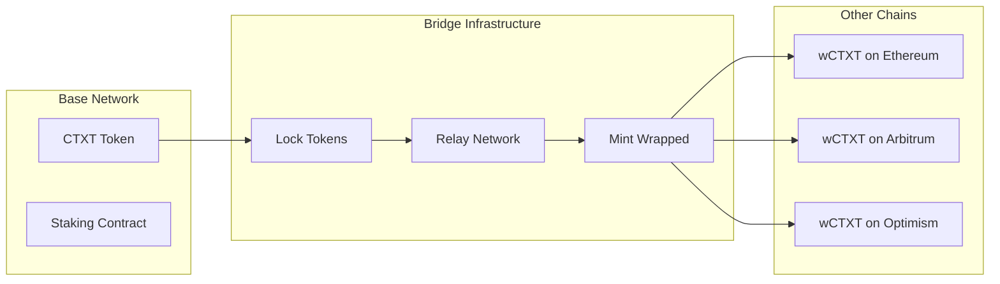

### 3. NFT Achievements System

```typescript
interface AchievementNFT {
    tokenId: number;
    achievementType: 
        | "EarlyAdopter"      // First 1000 users
        | "ConversationMaster" // 1000+ quality conversations
        | "KnowledgeBuilder"   // 500+ graph nodes created
        | "QualityChampion"    // 90%+ average quality
        | "StakingWhale"       // Platinum tier reached
        | "CommunityHelper"    // 100+ validations;
    metadata: {
        earnedDate: string;
        rarity: "common" | "rare" | "epic" | "legendary";
        boost: number; // Earning multiplier
    };
}
```

## 🛡️ Security Architecture

### Smart Contract Security

1. **Multi-signature Wallets**
   - Treasury: 3/5 multisig
   - Team tokens: 2/3 multisig
   - Emergency pause: 2/3 admin multisig

2. **Time Locks**
   - 48-hour delay for critical functions
   - 7-day lock for unstaking
   - 1-year cliff for team vesting

3. **Security Features**
   - Reentrancy guards on all contracts
   - Pausable functionality
   - Role-based access control
   - Upgradeable proxy pattern (planned)

### Backend Security Integration

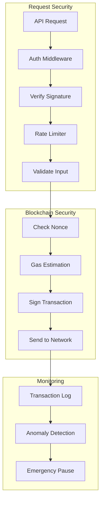

## 📈 Performance & Scalability

### Blockchain Optimization Strategies

1. **Layer 2 Scaling (Base)**
   - 1000x lower fees than Ethereum
   - 2-second block times
   - EIP-4844 blob support

2. **Batch Operations**
   - Groups up to 100 rewards per transaction
   - Merkle tree for efficient claims
   - Meta-transaction support

3. **Caching Layer**
   - Redis for real-time balances
   - 5-minute cache for leaderboards
   - Optimistic UI updates

### Load Distribution

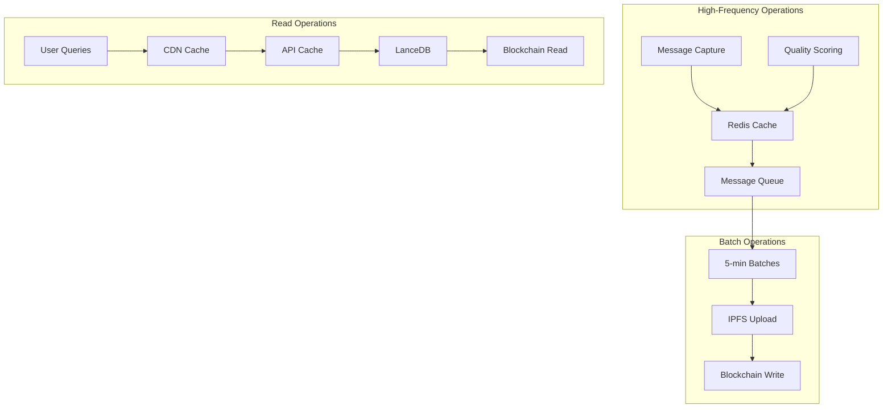

## 🌐 Ecosystem Integration

### Developer APIs (Coming Soon)

```typescript
// Contextly SDK
import { ContextlySDK } from '@contextly/sdk';

const sdk = new ContextlySDK({
    apiKey: 'your-api-key',
    network: 'base-mainnet'
});

// Get user's knowledge graph
const graph = await sdk.getKnowledgeGraph(walletAddress);

// Submit contribution
const contribution = await sdk.submitContribution({
    content: 'AI conversation content',
    type: 'conversation',
    platform: 'custom-app',
    metadata: { source: 'my-app' }
});

// Check earnings
const earnings = await sdk.getEarnings(walletAddress);
```

### Partner Integrations

1. **AI Platforms**
   - Native Claude/ChatGPT/Gemini support
   - API for custom AI integrations
   - Webhook support for real-time capture

2. **DeFi Protocols**
   - CTXT liquidity pools
   - Staking rewards optimization
   - Yield aggregator partnerships

3. **Data Consumers**
   - Anonymized conversation datasets
   - Knowledge graph insights
   - Trend analysis APIs

## 🚀 Launch Strategy & Tokenomics

### Token Launch Phases

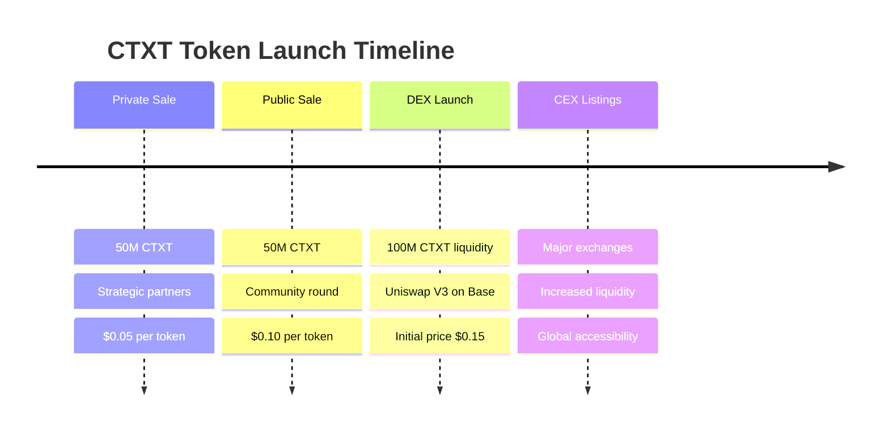

### Revenue Model

1. **Transaction Fees** (2% of rewards)
   - Funds ongoing development
   - Supports infrastructure costs
   - Community treasury allocation

2. **Premium Features** (paid in CTXT)
   - Advanced analytics
   - API access
   - Priority support

3. **Data Marketplace** (future)
   - Anonymized insights
   - Trend reports
   - Research datasets

## 📞 Support & Resources

- **Documentation**: docs.contextly.ai
- **Discord Community**: discord.gg/contextly
- **GitHub**: github.com/contextly/contextly
- **Support Email**: support@contextly.ai
- **Smart Contracts**: basescan.org/address/[contracts]

---

*This comprehensive analysis covers the entire Contextly.ai system architecture including the Chrome extension, backend services, and complete blockchain implementation. The platform represents a sophisticated integration of AI conversation capture, decentralized rewards through the CTXT token on Base blockchain, knowledge graph construction, and community governance. With smart contracts handling user registration, contribution validation, and rewards distribution, Contextly creates a sustainable ecosystem where quality AI interactions are valued and rewarded.*